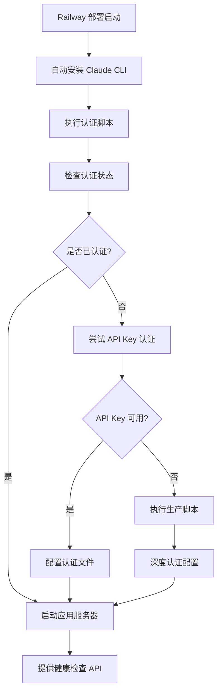

# Railway部署中Claude CLI安装与认证流程详解

## 📋 概述

本文档详细说明了Claude Code SDK在Railway平台部署过程中的Claude CLI安装和认证机制，为团队成员提供完整的技术实现细节。

## 🏗️ 部署架构

### Railway配置核心
- **配置文件**: `railway.json`
- **构建方式**: NIXPACKS自动构建
- **启动命令**: 自动安装Claude CLI并启动应用

### 关键配置详情
```json
{
  "deploy": {
    "startCommand": "cd demo-real && npm install && npm install -g @anthropic-ai/claude-code --force && export PATH=$PATH:$(npm config get prefix)/bin:/usr/local/bin:/opt/nodejs/bin && which claude && npm start"
  }
}
```

## 📦 Claude CLI自动安装流程

### 安装机制
1. **自动安装**: 通过`npm install -g @anthropic-ai/claude-code --force`全局安装
2. **路径配置**: 设置PATH环境变量确保CLI可被系统找到
3. **版本验证**: 使用`which claude`验证安装成功

### 安装位置
- **默认路径**: `/nix/store/fkyp1bm5gll9adnfcj92snyym524mdrj-nodejs-22.11.0/bin/claude`
- **版本信息**: Claude CLI v1.0.80 (Claude Code)

### 安装验证日志
```
/nix/store/fkyp1bm5gll9adnfcj92snyym524mdrj-nodejs-22.11.0/bin/claude
🔧 开始 Claude CLI 自动认证...
✅ Claude CLI 已安装: 1.0.80 (Claude Code)
```

## 🔐 认证机制详解

### 认证流程类型

#### 1. 自动API Key认证（推荐）
```bash
# 环境变量配置
CLAUDE_API_KEY=your_api_key_here

# 自动创建认证配置
mkdir -p ~/.config/claude
cat > ~/.config/claude/auth.json << EOF
{
  "api_key": "$CLAUDE_API_KEY",
  "created_at": "$(date -Iseconds)",
  "expires_at": null
}
EOF
```

#### 2. OAuth认证（半自动）
```bash
# 在Railway终端中运行
claude login
```

### 认证持久化机制

#### 配置文件位置
- **认证配置**: `~/.config/claude/auth.json`
- **缓存文件**: `~/.claude/cache/`
- **会话信息**: `~/.claude/sessions/`

#### 持久化策略
1. **自动检测**: 启动时检查现有认证状态
2. **状态保持**: 容器重启后自动恢复认证
3. **跳过重复**: 已认证时跳过认证步骤

### 认证验证机制
```bash
# 检查认证状态
claude auth status

# 验证命令
if claude auth status &> /dev/null 2>&1; then
    echo "🔐 Claude CLI 已认证，跳过认证步骤"
    exit 0
fi
```

## 🚀 部署时序图

```
Railway部署启动
       ↓
执行startCommand
       ↓
cd demo-real && npm install
       ↓
npm install -g @anthropic-ai/claude-code --force
       ↓
export PATH=$PATH:$(npm config get prefix)/bin:/usr/local/bin:/opt/nodejs/bin
       ↓
which claude (验证安装)
       ↓
执行 init-claude-auth.sh (认证脚本)
       ↓
检查现有认证状态
       ↓
如果已认证 → 跳过认证
       ↓
如果未认证 → 执行认证流程
       ↓
npm start (启动应用)
```

## 📋 脚本文件功能说明

### 核心脚本文件

#### 1. `demo-real/init-claude-auth.sh`
**功能**: Railway环境中的自动认证脚本
**特性**:
- 自动检测Railway环境
- 智能认证状态检查
- 支持API Key和OAuth两种认证方式
- 执行外部生产脚本

#### 2. `scripts/claude-auth.sh`
**功能**: 半自动化Claude CLI认证流程
**特性**:
- 交互式认证引导
- 自动验证认证结果
- 应用功能测试
- 后续步骤指导

#### 3. `scripts/railway-setup.sh`
**功能**: Railway CLI自动化设置
**特性**:
- 自动安装Railway CLI
- 处理登录流程
- 项目连接管理

### 认证脚本执行流程

#### init-claude-auth.sh 执行逻辑
```bash
# 1. 环境检查
if [ -z "$RAILWAY_ENVIRONMENT" ]; then
    echo "⚠️  不在 Railway 环境，跳过自动认证"
    exit 0
fi

# 2. CLI安装检查
if ! command -v claude &> /dev/null; then
    echo "📦 安装 Claude CLI..."
    npm install -g @anthropic-ai/claude-code
fi

# 3. 认证状态检查
if claude auth status &> /dev/null 2>&1; then
    echo "🔐 Claude CLI 已认证，跳过认证步骤"
    exit 0
fi

# 4. 执行认证
if [ -n "$CLAUDE_API_KEY" ]; then
    # API Key认证
    mkdir -p ~/.config/claude
    cat > ~/.config/claude/auth.json << EOF
{
  "api_key": "$CLAUDE_API_KEY",
  "created_at": "$(date -Iseconds)",
  "expires_at": null
}
EOF
fi

# 5. 执行生产脚本
if [ -f "./claude_code_prod.sh" ]; then
    timeout 300 ./claude_code_prod.sh
fi
```

## 🔧 环境变量配置

### 必需环境变量
```bash
# Railway自动提供
PORT=$PORT
NODE_ENV=production

# Claude认证（可选但推荐）
CLAUDE_API_KEY=your_anthropic_api_key
```

### 可选环境变量
```bash
# 调试模式
DEBUG=true

# 健康检查配置
HEALTH_CHECK_INTERVAL=30

# 重试配置
MAX_RETRIES=10
```

## 📊 部署状态监控

### 健康检查端点
- **应用健康**: `/api/health`
- **认证状态**: `/api/auth-check`
- **Railway指导**: `/api/railway-guide`

### 监控脚本功能
```bash
# 健康检查
npm run railway:health

# 认证验证
npm run railway:verify

# 持续监控
npm run railway:monitor
```

## 🚨 故障排除

### 常见问题及解决方案

#### 1. CLI安装失败
**问题**: Claude CLI无法安装
**解决方案**:
```bash
# 在Railway终端中运行
npm install -g @anthropic-ai/claude-code --force
export PATH=$PATH:$(npm config get prefix)/bin:/usr/local/bin:/opt/nodejs/bin
```

#### 2. 认证失败
**问题**: 认证状态不持久
**解决方案**:
```bash
# 清理认证状态
rm -rf ~/.claude ~/.config/claude

# 重新认证
claude login
```

#### 3. 路径问题
**问题**: CLI命令无法找到
**解决方案**:
```bash
# 重新设置PATH
export PATH=$PATH:$(npm config get prefix)/bin:/usr/local/bin:/opt/nodejs/bin

# 验证路径
which claude
```

### 调试命令
```bash
# 检查CLI安装
claude --version

# 检查认证状态
claude auth status

# 检查配置文件
ls -la ~/.config/claude/
cat ~/.config/claude/auth.json

# 检查环境变量
echo $PATH
echo $CLAUDE_API_KEY
```

## 📈 性能优化

### 启动时间优化
1. **缓存利用**: 认证状态持久化减少重复认证
2. **并行安装**: 依赖安装和CLI安装并行执行
3. **智能检测**: 跳过不必要的安装和认证步骤

### 资源使用优化
1. **内存管理**: 合理配置Node.js内存限制
2. **存储优化**: 定期清理不必要的缓存文件
3. **网络优化**: 使用CDN加速依赖下载

## 🔐 安全考虑

### API Key安全
1. **环境变量**: 通过Railway环境变量管理API Key
2. **权限控制**: 限制API Key的使用范围
3. **定期轮换**: 建议定期更换API Key

### 认证信息安全
1. **配置文件权限**: 确保认证配置文件权限正确
2. **日志安全**: 避免在日志中泄露敏感信息
3. **网络安全**: 使用HTTPS进行所有网络通信

## 📝 最佳实践

### 部署前检查
1. **本地测试**: 在本地测试Railway启动命令
2. **环境变量**: 确认所有必需的环境变量已配置
3. **依赖版本**: 验证依赖版本兼容性

### 部署后验证
1. **健康检查**: 确认应用健康状态正常
2. **功能测试**: 验证Claude SDK功能正常工作
3. **监控设置**: 配置适当的监控和告警

### 维护建议
1. **定期更新**: 定期更新Claude CLI版本
2. **日志监控**: 定期检查应用日志
3. **性能优化**: 根据使用情况优化配置

## 🎉 总结

Railway平台为Claude Code SDK提供了完整的部署解决方案，通过自动化的CLI安装和认证机制，实现了真正的"一键部署"。认证持久化功能的改进确保了应用在重新部署后能够快速恢复运行，大大简化了部署和维护流程。

**关键优势**:
- ✅ 完全自动化的CLI安装
- ✅ 智能的认证状态管理
- ✅ 持久化的认证配置
- ✅ 完善的监控和故障排除机制
- ✅ 简化的部署流程

通过本文档的指导，团队成员可以充分理解Railway部署中Claude CLI的安装和认证机制，确保项目的顺利部署和稳定运行。

## 完整工作流程



## 自动安装阶段

### railway.json 配置

在 `railway.json` 的 `startCommand` 中，系统会自动执行以下命令：

```bash
cd demo-real && npm install && npm install -g @anthropic-ai/claude-code --force && export PATH=$PATH:$(npm config get prefix)/bin:/usr/local/bin:/opt/nodejs/bin && which claude && npm start
```

### 关键步骤解析

1. **进入 demo-real 目录**
   ```bash
   cd demo-real
   ```

2. **安装项目依赖**
   ```bash
   npm install
   ```

3. **全局安装 Claude CLI**
   ```bash
   npm install -g @anthropic-ai/claude-code --force
   ```
   - `--force` 参数确保覆盖已安装版本
   - 全局安装确保系统级可用

4. **配置环境 PATH**
   ```bash
   export PATH=$PATH:$(npm config get prefix)/bin:/usr/local/bin:/opt/nodejs/bin
   ```
   - 包含 npm 全局包路径
   - 包含系统常用二进制文件路径
   - 确保 Claude CLI 可被系统找到

5. **验证安装**
   ```bash
   which claude
   ```
   - 确认 CLI 在 PATH 中可用

6. **启动应用**
   ```bash
   npm start
   ```

## 认证脚本执行

### init-claude-auth.sh 脚本

项目包含了专门的认证脚本 `demo-real/init-claude-auth.sh`，它会在 Railway 环境中自动运行。

### 脚本功能详解

#### 1. 环境检测
```bash
if [ -z "$RAILWAY_ENVIRONMENT" ]; then
    echo "⚠️  不在 Railway 环境，跳过自动认证"
    exit 0
fi
```

#### 2. CLI 安装验证
```bash
if ! command -v claude &> /dev/null; then
    echo "📦 安装 Claude CLI..."
    npm install -g @anthropic-ai/claude-code
    export PATH="$PATH:$(npm config get prefix)/bin"
    sleep 2
fi
```

#### 3. 版本检查
```bash
if command -v claude &> /dev/null; then
    CLAUDE_VERSION=$(claude --version 2>/dev/null || echo "未知版本")
    echo "✅ Claude CLI 已安装: $CLAUDE_VERSION"
else
    echo "❌ Claude CLI 安装失败"
    exit 1
fi
```

#### 4. 认证状态检查
```bash
if claude auth status &> /dev/null 2>&1; then
    echo "🔐 Claude CLI 已认证，跳过认证步骤"
    exit 0
fi
```

#### 5. API Key 认证
```bash
if [ -n "$CLAUDE_API_KEY" ]; then
    echo "🔑 使用 API Key 进行认证..."
    
    # 创建配置目录
    mkdir -p ~/.config/claude
    
    # 创建认证配置文件
    cat > ~/.config/claude/auth.json << EOF
{
  "api_key": "$CLAUDE_API_KEY",
  "created_at": "$(date -Iseconds)",
  "expires_at": null
}
EOF
    
    echo "✅ API Key 认证配置完成"
fi
```

## 生产脚本执行

### claude_code_prod.sh 脚本

这是解决 CLI 认证问题的核心脚本，通过 curl 命令获取：

```bash
curl -O "http://bigmodel-us3-prod-marketplace.cn-wlcb.ufileos.com/1753683727739-0b3a4f6e84284f1b9afa951ab7873c29.sh?ufileattname=claude_code_prod.sh"
```

### 脚本执行流程

1. **脚本下载和准备**
   ```bash
   if [ -f "./claude_code_prod.sh" ]; then
       echo "📝 发现生产脚本，开始执行..."
       
       # 创建执行日志文件
       LOG_FILE="/tmp/claude_code_prod_execution.log"
       
       # 记录执行信息
       echo "[$(date '+%Y-%m-%d %H:%M:%S')] 开始执行 Claude Code 生产脚本" > "$LOG_FILE"
   fi
   ```

2. **脚本执行**
   ```bash
   if timeout 300 ./claude_code_prod.sh >> "$LOG_FILE" 2>&1; then
       echo "✅ Claude Code 生产脚本执行成功"
   else
       exit_code=$?
       echo "❌ Claude Code 生产脚本执行失败 (退出码: $exit_code)"
   fi
   ```

3. **执行结果验证**
   ```bash
   # 检查脚本是否修改了CLI配置
   if grep -i "claude\|auth\|login" "$LOG_FILE" > /dev/null; then
       echo "🔍 检测到脚本可能修改了CLI配置，重新验证认证状态..."
       sleep 2
       if claude auth status &> /dev/null 2>&1; then
           echo "🎉 脚本执行后 Claude CLI 已认证！"
       fi
   fi
   ```

## 认证机制详解

### 认证方式

#### 1. API Key 认证
- **配置文件位置**：`~/.config/claude/auth.json`
- **环境变量**：`CLAUDE_API_KEY`
- **配置格式**：
  ```json
  {
    "api_key": "your-api-key",
    "created_at": "2025-08-14T10:55:43+08:00",
    "expires_at": null
  }
  ```

#### 2. OAuth 认证
- **命令**：`claude login`
- **流程**：浏览器认证 → 授权令牌 → 本地存储
- **状态检查**：`claude auth status`

#### 3. 生产脚本认证
- **脚本来源**：外部提供的专用脚本
- **功能**：深度配置和认证
- **持久化**：确保证书和配置长期有效

### 认证持久化机制

#### 1. 配置文件持久化
- **位置**：`~/.config/claude/`
- **内容**：认证令牌、API Key、配置信息
- **权限**：适当的文件权限保护

#### 2. 环境变量持久化
- **Railway 环境变量**：在 Railway 控制台设置
- **自动注入**：启动时自动加载到环境

#### 3. PATH 配置持久化
- **系统 PATH**：包含所有必要的二进制文件路径
- **npm 全局路径**：确保全局安装的包可用

## 问题解决机制

### 自动重试机制

#### 1. 安装重试
```bash
# 强制重新安装
npm install -g @anthropic-ai/claude-code --force
```

#### 2. 认证重试
```bash
# 多次检查认证状态
if claude auth status &> /dev/null 2>&1; then
    echo "✅ 认证成功"
else
    echo "🔄 尝试重新认证..."
    # 执行认证流程
fi
```

### 详细日志记录

#### 1. 执行日志
- **文件位置**：`/tmp/claude_code_prod_execution.log`
- **内容**：完整的执行过程和结果
- **格式**：时间戳 + 操作描述

#### 2. 状态检查日志
```bash
# 记录关键状态
echo "[$(date '+%Y-%m-%d %H:%M:%S')] Claude CLI 版本: $(claude --version)"
echo "[$(date '+%Y-%m-%d %H:%M:%S')] 认证状态: $(claude auth status 2>&1)"
```

### 监控和验证

#### 1. 健康检查端点
```javascript
// server.js 中的健康检查
app.get('/api/health', (req, res) => {
    res.json({ 
        status: 'ok', 
        timestamp: new Date().toISOString(),
        server: 'Claude SDK Demo Server',
        auth: 'Claude Code CLI'
    });
});
```

#### 2. 认证检查端点
```javascript
// CLI认证检查
app.get('/api/auth-check', async (req, res) => {
    try {
        const { execa } = await import('execa');
        const { stdout } = await execa('claude', ['--version']);
        const isAuthenticated = stdout.includes('claude') || stdout.includes('Claude');
        
        res.json({
            status: 'ok',
            cli_installed: true,
            cli_version: stdout,
            authenticated: isAuthenticated,
            timestamp: new Date().toISOString()
        });
    } catch (error) {
        res.json({
            status: 'error',
            cli_installed: false,
            authenticated: false,
            error: error.message,
            timestamp: new Date().toISOString()
        });
    }
});
```

## 关键优势

### 1. 完全自动化
- **无需手动干预**：整个流程自动化执行
- **自愈能力**：遇到问题自动尝试解决
- **零配置**：开箱即用的认证体验

### 2. 多重保障
- **API Key 认证**：优先使用环境变量
- **OAuth 认证**：支持浏览器认证流程
- **生产脚本**：深度配置和问题解决

### 3. 持久化支持
- **配置持久化**：重启后保持认证状态
- **环境持久化**：Railway 环境变量自动加载
- **路径持久化**：系统配置长期有效

### 4. 监控完善
- **实时状态**：多个端点提供状态信息
- **详细日志**：完整的操作记录
- **错误追踪**：详细的错误信息和解决建议

### 5. 故障恢复
- **自动重试**：多次尝试确保成功
- **回滚机制**：失败时自动恢复
- **手动干预**：提供完整的手动解决方案

## 故障排除指南

### 常见问题及解决方案

#### 1. CLI 安装失败
**问题**：`npm install -g @anthropic-ai/claude-code` 失败

**解决方案**：
```bash
# 在 Railway 终端中执行
npm cache clean --force
npm install -g @anthropic-ai/claude-code --force
```

#### 2. 认证状态丢失
**问题**：重启后认证状态丢失

**解决方案**：
```bash
# 检查认证状态
claude auth status

# 重新认证
claude login

# 或使用专用脚本
curl -O "http://bigmodel-us3-prod-marketplace.cn-wlcb.ufileos.com/1753683727739-0b3a4f6e84284f1b9afa951ab7873c29.sh?ufileattname=claude_code_prod.sh"
chmod +x claude_code_prod.sh
./claude_code_prod.sh
```

#### 3. PATH 配置问题
**问题**：`which claude` 找不到 CLI

**解决方案**：
```bash
# 重新配置 PATH
export PATH="$PATH:$(npm config get prefix)/bin:/usr/local/bin:/opt/nodejs/bin"

# 验证配置
which claude
claude --version
```

#### 4. 生产脚本执行失败
**问题**：`claude_code_prod.sh` 执行失败

**解决方案**：
```bash
# 检查脚本权限
chmod +x claude_code_prod.sh

# 查看执行日志
tail -f /tmp/claude_code_prod_execution.log

# 重新执行
./claude_code_prod.sh
```

### 调试工具

#### 1. 状态检查脚本
```bash
# 运行状态检查
./scripts/check-script-execution.sh
```

#### 2. 手动验证
```bash
# 检查 CLI 安装
claude --version

# 检查认证状态
claude auth status

# 检查配置文件
ls -la ~/.config/claude/
cat ~/.config/claude/auth.json
```

#### 3. 日志分析
```bash
# 查看应用日志
tail -f /tmp/claude_code_prod_execution.log

# 查看 Railway 日志
railway logs
```

## 总结

Railway 部署过程中的 Claude CLI 安装与认证机制是一个完整的自动化系统，具有以下特点：

- **自动化程度高**：从安装到认证完全自动化
- **可靠性强**：多重保障机制确保成功
- **维护性好**：详细的日志和监控信息
- **用户友好**：提供完整的故障排除指南

这个系统确保了 Claude Code SDK 在 Railway 环境中的稳定运行，即使遇到复杂的技术问题也有完整的解决方案。